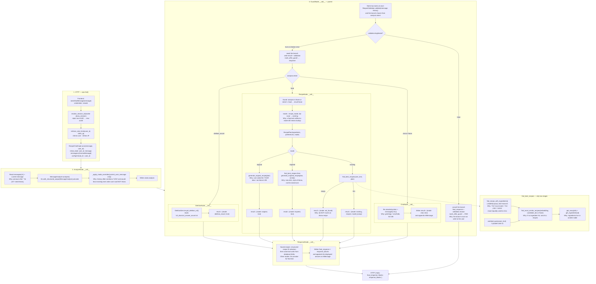
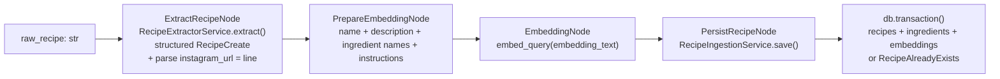

# Alona chat — exact runtime flow

This is the path of one `POST /chat` request. Node names are LangGraph keys. Methods are the real callables.

---

## GraphState fields (shared memory)

Written incrementally. `messages` uses `add_messages` so it **appends**, it does not replace.

| Field | Type | Who writes it | Purpose |
|---|---|---|---|
| `user_id` | `str` | `RecipeChatGraph.arun` | Session id = LangGraph `thread_id` (from cookie `alona_session`) |
| `message` | `str` | `arun` | Latest user text only |
| `analysis` | `MessageAnalysis \| None` | `AnalyzeNode` | Intent + recipe mode + ingredients |
| `validation` | `RequestValidation \| None` | `GuardNode` | `legitimate` plus a user-facing `reason` when the request is rejected. `None` if the checker failed and the flow continued |
| `result` | `dict \| None` | Chat / Recipe / Dietitian, via `GuardNode` | Structured work product for `ResponseNode`. Cleared when the request is rejected |
| `messages` | `list[BaseMessage]` | `arun` + Guard/Response | Rolling conversation (checkpointer persists it) |
| `final_response` | `str \| None` | `GuardNode` on reject, else `ResponseNode` | Complete Markdown for conversation history and older clients |
| `response_blocks` | `list[dict] \| None` | `GuardNode` on reject, else `ResponseNode` | Ordered text and recipe cards; each recipe includes its own saved image |
| `context` | `dict` | unused today | Reserved |

### MessageAnalysis fields

| Field | Values | Why it exists |
|---|---|---|
| `intent` | `chat` / `food` / `dietitian_escort` | **Only** this chooses the branch inside `GuardNode` |
| `recipe_mode` | `existing` / `inspired` / `original` / `none` | Used **inside** `RecipeNode`, not for routing |
| `ingredients` | `list[str]` | Keywords for SQL substring match |
| `preferences` | `list[str]` | Passed into generation prompts |
| `confidence` | `float` | Stored, not used for branching |

---

## Chat graph (runtime)

---

## Recipe presentation

For saved recipes, `ResponseNode` asks for a `RecipePresentationPlan` containing
intro text, explicit recipe IDs, and optional follow-up text. `build_recipe_response`
selects only those IDs from the search results and copies each recipe's saved name,
ingredients, instructions, source, and photo into one `recipe` block. Mentioning an
alternative in prose does not select its photo. Unknown IDs are rejected.

The frontend renders `blocks` directly in order, independently of the model's
Markdown headings. Text blocks cannot introduce extra photos. Missing photos leave
the rest of their recipe visible. `reply` contains the same selected recipes as
Markdown for history and older clients, with photos beside their respective titles;
the API never appends a gallery of search-result images.

`RecipeChatGraph.arun` clears per-turn analysis, validation, result, and presentation
fields before each invocation. Conversation messages remain available, while stale
recipe cards and rejection state cannot carry into the next response.

## Why routing is intent-only

`recipe_mode` is **not** a graph edge. `GuardNode` picks chat, recipe, or dietitian from `analysis.intent` only, and runs that branch beside the legitimacy check. One `recipe` node reads `analysis.recipe_mode` and picks a method:

- **existing** — user wants a saved Alona recipe (`מתכון של אלונה`, `שמור אצלך`)
- **inspired** — new recipe in her style
- **original** — invent, explicitly not from the DB (`יצירתי`, `לא מהמתכונים של אלונה`, `עוד רעיון`)
- **none** on a food intent is treated as **existing** so “יש לי אורז” still searches

Overrides run on the **latest user turn only**, because conversation history kept the word אלונה and forced lookup.

---

## Ingestion graph (offline)

`RecipeIngestionState`: `raw_recipe`, `instagram_url`, `recipe`, `embedding_text`, `embedding`, `recipe_id`, `success`, `error`.

---

## Persistence

- **Recipes:** `recipes` / `recipe_ingredients` / `recipe_embeddings` (vector 1536)
- **Chat memory:** LangGraph `AsyncPostgresSaver`, `thread_id = user_id`
- **Why cookie not body `user_id`:** client-supplied ids let anyone join another thread
